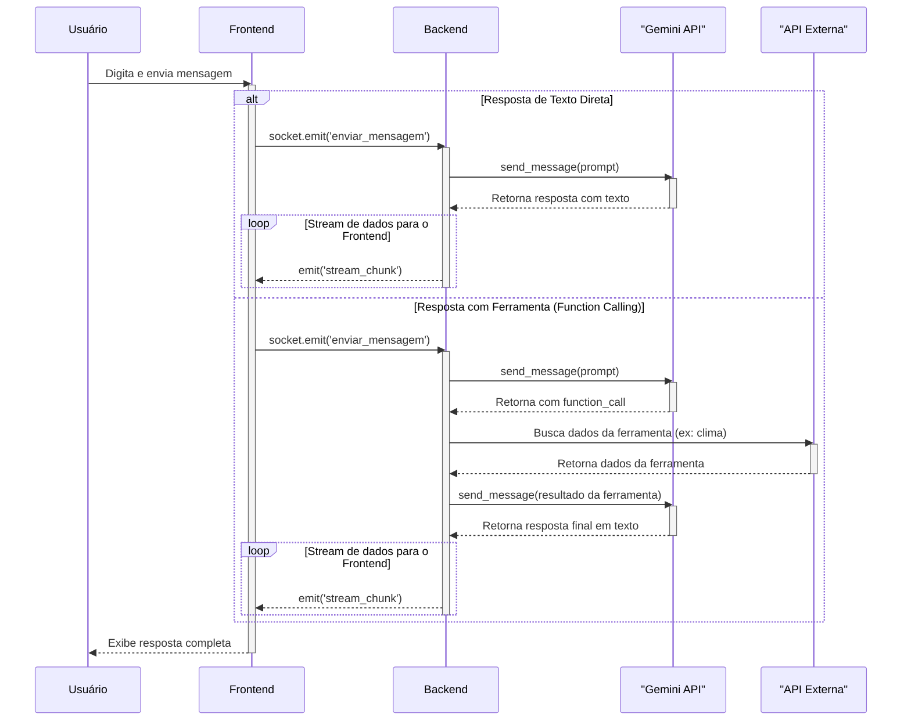

# DominiChat - Assistente de IA com Ferramentas


## 📖 Sobre o Projeto

**DominiChat** é um assistente de IA conversacional construído com Python, Flask e a API do Google Gemini. Este projeto demonstra a integração de um grande modelo de linguagem (LLM) com ferramentas externas em tempo real, permitindo que o chatbot acesse informações como data, hora e previsão do tempo, além de analisar arquivos como imagens e PDFs enviados pelo usuário.

A comunicação entre o frontend e o backend é feita em tempo real usando WebSockets, proporcionando uma experiência de chat fluida e interativa.

### ✨ Inspiração

Este projeto foi desenvolvido por **Lincoln Matheus**, aluno do curso de Análise e Desenvolvimento de Sistemas no **Instituto Federal do Piauí (IFPI)**, como parte da disciplina de **Inteligência Artificial**, ministrada pelo **Prof. Dr. Otílio Paulo**.

O nome **DominiChat** é uma homenagem a Brenda Dominique, grande amor, inspiração e companheira do autor.

## 🚀 Funcionalidades

- **Chat Conversacional:** Interaja com a IA de forma natural e fluida.
- **Análise de Arquivos:** Envie imagens ou documentos PDF para que a IA os analise e responda a perguntas sobre eles.
- **Ferramentas em Tempo Real:**
  - **Hora Certa:** Pergunte "que horas são?" e receba a data e hora atuais no fuso horário de Brasília.
  - **Previsão do Tempo:** Peça a temperatura de qualquer cidade do mundo e receba uma estimativa atualizada.
- **Interface Neumórfica:** Design moderno e limpo com suporte a tema claro e escuro.
- **Persona Personalizada:** O chatbot tem uma personalidade definida, sendo prestativo e amigável, mas com um toque de sarcasmo se o usuário for repetitivo.

## 🏗️ Fluxo do Sistema (Diagrama de Sequência)

O diagrama abaixo ilustra o fluxo de comunicação entre os componentes do sistema, cobrindo tanto uma resposta de texto direta quanto uma resposta que requer o uso de ferramentas (Function Calling).



## 🛠️ Tecnologias Utilizadas

- **Backend:**
  - **Python:** Linguagem principal do projeto.
  - **Flask:** Micro-framework web para servir a aplicação.
  - **Flask-SocketIO:** Para comunicação em tempo real (WebSockets).
- **Inteligência Artificial:**
  - **Google Gemini 1.5 Flash (`gemini-1.5-flash-latest`):** Modelo de linguagem utilizado para gerar as respostas e utilizar as ferramentas.
- **APIs Externas:**
  - **Open-Meteo:** API gratuita para obter dados de previsão do tempo.
- **Frontend:**
  - **HTML5:** Estrutura da página.
  - **CSS3:** Estilização, incluindo o design neumórfico e o modo escuro.
  - **JavaScript:** Manipulação do DOM e comunicação com o backend via Socket.IO.
- **Deployment:**
  - **Railway:** Plataforma de hospedagem da aplicação.

## 🏁 Como Executar Localmente

Siga os passos abaixo para rodar o projeto na sua máquina.

### Pré-requisitos

- Python 3.8 ou superior
- Uma chave de API para o Google Gemini. Você pode obter uma no [Google AI Studio](https://aistudio.google.com/app/apikey).

### Instalação

1.  **Clone o repositório:**
    ```bash
    git clone `https://github.com/LincolnMatheus97/api_gemini.git`
    cd api_gemini
    ```

2.  **Crie e ative um ambiente virtual:**
    ```bash
    # Para Windows
    python -m venv .venv
    .\.venv\Scripts\activate

    # Para macOS/Linux
    python3 -m venv .venv
    source .venv/bin/activate
    ```

3.  **Instale as dependências:**
    ```bash
    pip install -r requirements.txt
    ```

4.  **Configure as variáveis de ambiente:**
    - Crie um arquivo chamado `.env` na raiz do projeto.
    - Adicione as seguintes linhas ao arquivo, substituindo pelos seus valores:
      ```env
      API_KEY_GEMINAI="SUA_CHAVE_DE_API_DO_GEMINI"
      SECRET_KEY="UMA_CHAVE_SECRETA_FORTE_PODE_SER_QUALQUER_COISA"
      ```

5.  **Execute a aplicação:**
    ```bash
    python app.py
    ```
    Acesse `http://127.0.0.1:8080` no seu navegador para ver a aplicação funcionando.

## 📁 Estrutura do Projeto

```
/
├── .gitignore
├── app.py              # Arquivo principal do backend (Flask, SocketIO, Gemini)
├── requirements.txt    # Lista de dependências Python
├── static/
│   ├── css/
│   │   └── style.css   # Folha de estilos principal
│   ├── images/         # Imagens estáticas para o frontend
│   └── script/
│       └── script.js   # Lógica do frontend (JavaScript)
└── templates/
    └── index.html      # Estrutura HTML da página de chat
```

## ✒️ Autor

- **Lincoln Matheus** - [GitHub](https://github.com/LincolnMatheus97)

---